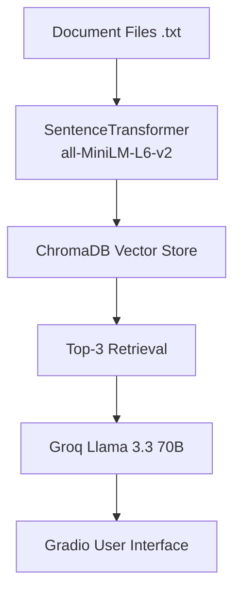

# Project 1 Planning: Guide

---

## Domain

The domain is Python programming fundamentals. This knowledge is valuable because beginners often need quick explanations of core Python concepts such as variables, data types, lists, dictionaries, functions, loops, conditionals, file handling, error handling, and object-oriented programming. Rather than searching through long tutorials, users can ask questions and receive answers grounded in a curated collection of Python learning documents.

---

## Documents

| #| Source                   | Description                                       | URL or location                  |
| -| -------------------------| --------------------------------------------------| ---------------------------------|
| 1| python_variables.txt     | Python variables, assignment, and dynamic typing  | documents/python_variables.txt|
| 2| python_data_types.txt    | Python data types including strings, integers etc | documents/python_data_types.txt  |
| 3| python_lists.txt         | Python lists, indexing, and common list operations| documents/python_lists.txt       |
| 4| python_dictionaries.txt  | Python dictionaries and key-value pair storage    | documents/python_dictionaries.txt|
| 5| python_functions.txt     | Python functions, parameters, and return values   | documents/python_functions.txt   |
| 6| python_loops.txt         | Python for loops, while loops, and loop controls  | documents/python_loops.txt       |
| 7| python_conditionals.txt  | Python if, elif, and else conditional statements  | documents/python_conditionals.txt|
| 8| python_file_handling.txt | Reading, writing, and managing files in Python    | documents/python_file_handling.txt|
| 9| python_error_handling.txt| Exception handling using try and except blocks    | documents/python_error_handling.txt|
|10| python_oop.txt           | Object-oriented programming (classes and object)  | documents/python_oop.txt         |

---

## Chunking Strategy

**Chunk size:** Entire document (1 chunk per document)

**Overlap:** 0

**Reasoning:** The documents are short educational notes, each covering a single Python topic. Splitting them further would separate related information and reduce retrieval quality. Because each document is less than 1,000 characters, storing each document as a single chunk is sufficient.

---

## Retrieval Approach

**Embedding model:** all-MiniLM-L6-v2 (Sentence Transformers)

**Top-k:** 3

**Production tradeoff reflection:** The all-MiniLM-L6-v2 model is lightweight, fast, and performs well for semantic search on short educational documents. For a production system, I would consider larger embedding models with stronger multilingual support, better domain-specific understanding, and longer context handling. The tradeoff would be increased cost, storage requirements, and latency.

---

## Evaluation Plan

| # | Question                             | Expected answer                                                           |
|---| ------------------------------------ | --------------------------------------------------------------------------|
| 1 | What is a Python variable?           | A Python variable stores data and is created when a value is assigned to it. |
| 2 | What is a list?                      | A list is an ordered and mutable collection that can store multiple items and allows duplicate values.|
| 3 | What is a dictionary?                | A dictionary stores data as key-value pairs and is useful for organizing labeled information.|
| 4 | What is object oriented programming? | Object-oriented programming (OOP) organizes code using classes and objects and supports concepts such as encapsulation, inheritance, polymorphism, and abstraction.|
| 5 | Who won the 2022 FIFA World Cup?     | The system should refuse to answer and respond with "I do not know" because the information is not present in the document collection.|

---

## Anticipated Challenges

1. Retrieval may return related but not exact documents when multiple Python concepts are semantically similar.

2. The model may attempt to answer questions outside the document collection unless grounding instructions are enforced.

---

## Architecture

---

## Architecture

---

## AI Tool Plan

**AI Tool:** ChatGPT

**Purpose:** Generate example test cases for evaluating the retrieval system.

**Input:** Requests for sample in-domain and out-of-domain questions.

**Expected Output:** Example test questions to verify that the system retrieves relevant Python documents and correctly responds with "I do not know" for questions outside the document collection.